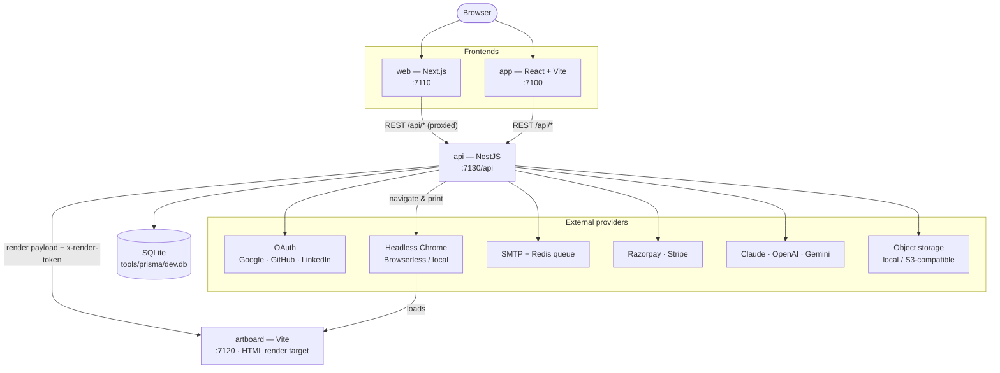
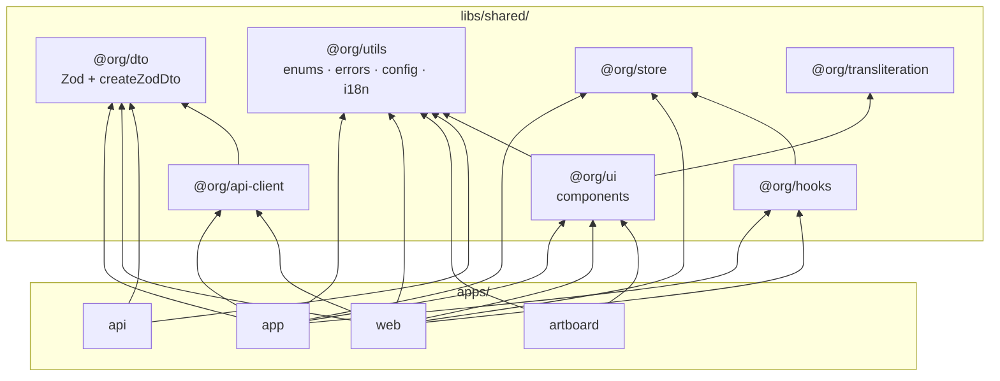
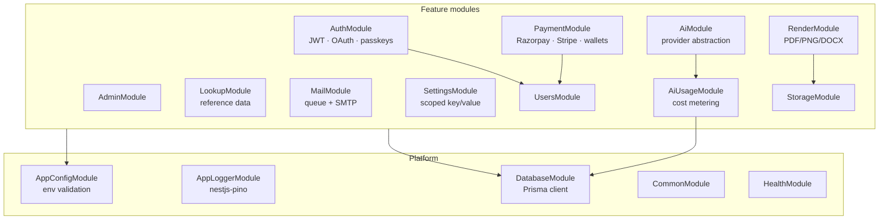
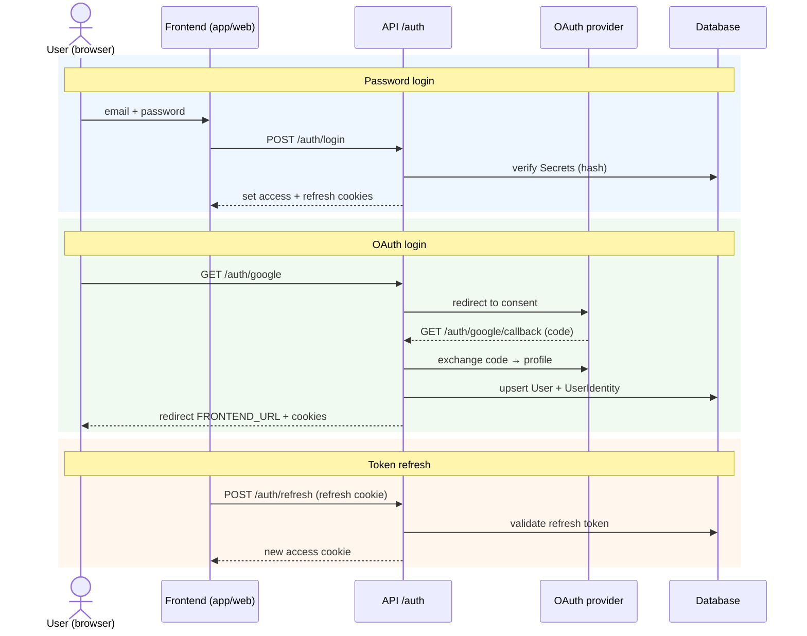
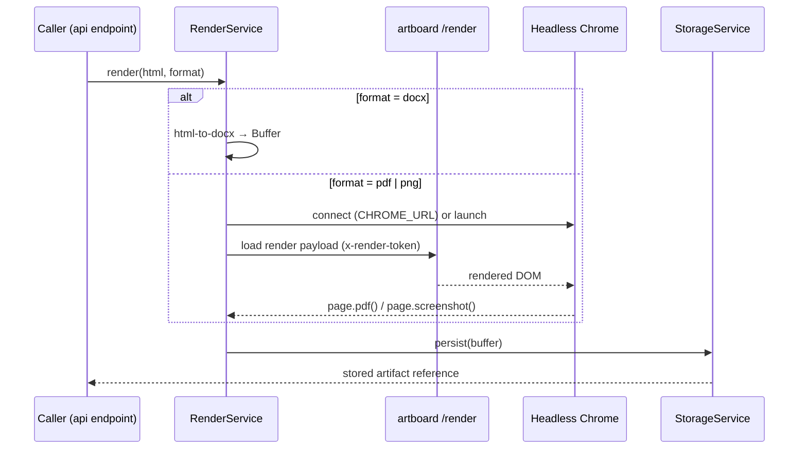
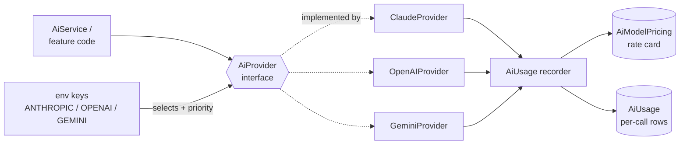
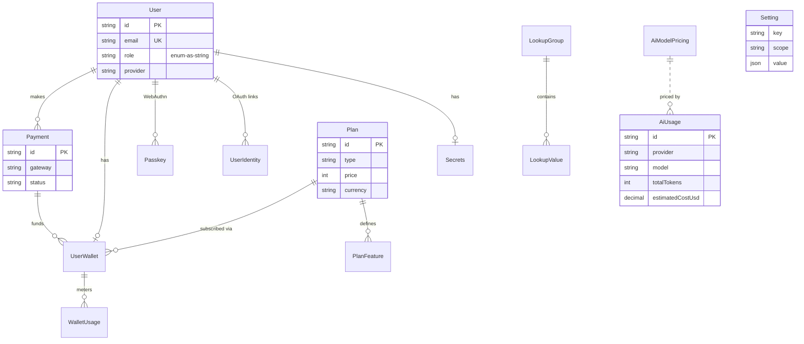

# Architecture

This document describes how **@org/starter** is put together: the apps, the shared
libraries, the runtime request/render/auth flows, and the data model. Diagrams are
[Mermaid](https://mermaid.js.org) and render on GitHub.

- [1. System context](#1-system-context)
- [2. Monorepo & dependency graph](#2-monorepo--dependency-graph)
- [3. API module map](#3-api-module-map)
- [4. Authentication flow](#4-authentication-flow)
- [5. Document render pipeline](#5-document-render-pipeline)
- [6. AI provider abstraction](#6-ai-provider-abstraction)
- [7. Data model](#7-data-model)

---

## 1. System context

Four deployable apps share one set of libraries and one database. The browser talks to
the **web** (Next.js) and **app** (React) frontends; both call the **api** (NestJS). The
API owns the database and fans out to external providers (OAuth, mail, payments, AI,
storage) and to the **artboard** renderer for document export.

---

## 2. Monorepo & dependency graph

The workspace is an [Nx](https://nx.dev) + pnpm monorepo. Apps depend on shared libs;
`@org/dto` is the contract shared by client and server (same Zod schema validates both
sides). Path resolution is via `tsconfig.base.json` `paths` (Vite uses `nxViteTsPaths`;
Next mirrors the paths in `apps/web/tsconfig.json` + `transpilePackages`).

> **Note:** the `@org/ui` barrel re-exports the rich-text editor, which imports
> `@org/transliteration`. Any `@org/ui` consumer therefore transitively needs that path
> registered — in `tsconfig.base.json`, and (for `web`) also in `apps/web/tsconfig.json`
> and `next.config.js` `transpilePackages`.

---

## 3. API module map

The NestJS API is a set of feature modules over a Prisma data layer, with global config,
logging, and a database module. Cross-cutting concerns (throttling, validation, cookies,
helmet) are applied in `main.ts` / `app.module.ts`.

---

## 4. Authentication flow

Auth supports password (local), OAuth (Google/GitHub/LinkedIn), and passkeys (WebAuthn).
Sessions use short-lived **access** + long-lived **refresh** JWTs in HTTP-only cookies;
OAuth callbacks redirect back to `FRONTEND_URL`.

---

## 5. Document render pipeline

`RenderService` turns HTML into **PDF/PNG** via headless Chrome, or **DOCX** via
`@turbodocx/html-to-docx`. Chrome is reached over a Browserless WebSocket (`CHROME_URL`)
or launched from a local binary. The **artboard** app hosts a `/render` route that the
API (or Chrome) loads with an internal `x-render-token`. Output is persisted through
`StorageService`.

---

## 6. AI provider abstraction

Per the project's interface-first principle, AI access goes through a single
`AiProvider` interface with concrete Claude / OpenAI / Gemini implementations selected by
config. Every call is metered by `AiUsageModule` (tokens, cost, latency) against an
`AiModelPricing` rate card.

---

## 7. Data model

Core entities (Prisma → SQLite). Former enum columns are `String`s whose allowed values
live in `@org/utils`; array columns are `Json`.

---

See [CONTRIBUTING.md](../CONTRIBUTING.md) for conventions and the golden rules, and the
[README](../README.md) for setup.
